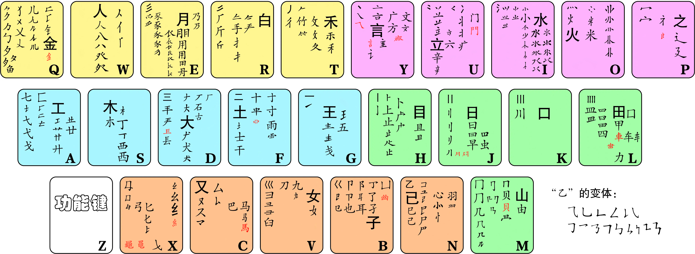

# 五笔输入方案管理
## 简介
五笔输入方案管理器，用于编辑五笔码表，并导出特定格式文件挂接到其它软件中，如搜狗拼音自定义短语格式、手机搜狗输入法的五笔的自定义方案格式、搜狗五笔格式等。

> 1. 内含方案为86五笔方案，包含汉字范围为cjkv基本区、扩展a区和标点区补充的“〇”（已校对）。参考码表含其它区汉字（未校对），有需求可自由添加。
> 2. 字根图基于86五笔方案，加入部分繁体字根，并修正错误字根，e.g. 麸 gqfw $\to$ gtfw，囱 tlq $\to$ tlt。
> 

## 功能
1. 编辑现有码表
    - 添加新编码
        - 含私人信息的敏感词汇或短语，需单独手动在words_pi.yaml与syms_pi.yaml两个文件中添加。
    - 删除现有编码
    - 修改编码候选排序

命令行输入格式：
``` cmd
字词格式 :[一-鿿㐀-䶿〇]+   [0-9]?    (?<=[1-9]?[ \t]+)[1-4]?
短语格式 :   [\S]+         [0-9]?            [a-z]+
            [\S]+         [a-z]+            [0-9]?
[一-鿿㐀-䶿〇]+ : 字词的汉字范围cjkv: bsc + a + cmp。
[0-9]? : 指定候选排序0-9, 0表示删除, 1-8表示位次, 9表示后置。
(?<=[1-9]?[ \t]+)[1-4]? : 指定码数1-4, 指定前必须先指定排序, 省略表示4码。
[\S]+ : 短语不含空字符。
[a-z]+ : 指定编码, 不可省略, 省略时按字词处理。
示例 :  五笔      1
        输入法
        好        1   2
        问题      2   2
        五笔nice  1   n
        五笔good  g
```


2. 导出码表文件
    - 导入PC搜狗拼音自定义短语格式
    - 导入Android搜狗五笔格式
        - 导入自定义五笔码表
        - 导入常用语
    - 导入PC搜狗五笔格式
        - 导入自定义码表
        - 导入用户词汇
        - 导入自定义短语
    > 含后缀withPi的文件，表示含个人信息词汇的文件版本。
